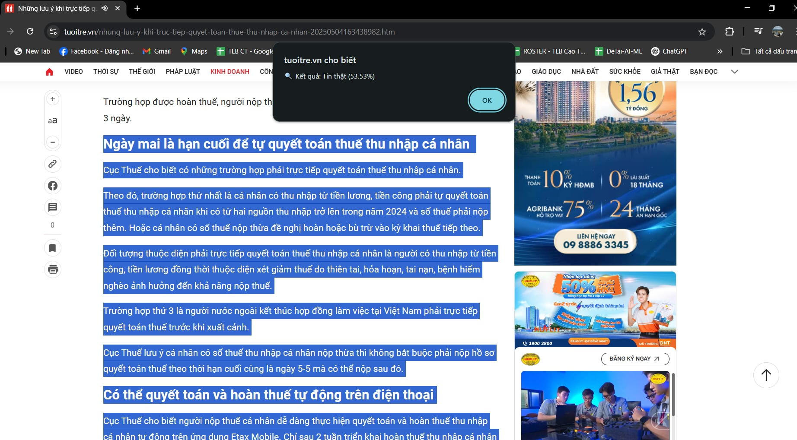
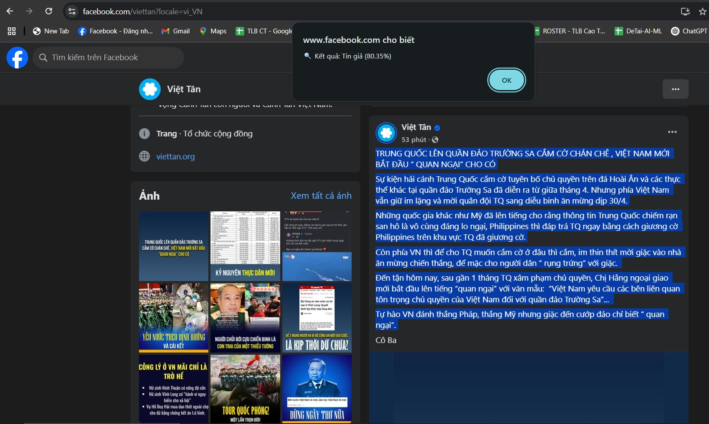

# Fake News Detection - Chrome Extension và Flask API

Dự án này bao gồm một ứng dụng Flask API để nhận diện tin giả kết hợp với một Chrome Extension để phát hiện tin giả trực tiếp từ trình duyệt. Dưới đây là hướng dẫn chi tiết về cách cài đặt và sử dụng cả hai thành phần của dự án.

## Các Yêu Cầu

- **Python 3.8+**
- **Pip (để cài đặt các thư viện cần thiết)**
- **Git (để quản lý mã nguồn)**
- **Google Chrome (để sử dụng Chrome Extension)** 

## 📁 Cấu trúc thư mục 
<pre><code>## 📁 Cấu trúc thư mục dự án ``` FakeNews-Extension/ ├── app.py ├── requirements.txt ├── README.md ├── extension_chrome/ │ ├── background.js │ ├── content.js │ ├── icon.img │ ├── manifest.json │ ├── popup.html │ ├── popup.js ├── data/ │ └── vn_news.csv ├── model/ │ └── phobert_tokernizer/ │ ├── added_tokens.json │ ├── bpe.codes │ ├── special_tokens_map.json │ ├── tokernizer_config.json │ └── vocab.txt ├── train/ │ └── phoBERT_SVM.ipynb ├── img/ │ ├── fake.png │ └── real.png ``` </code></pre>

## Cài Đặt Môi Trường

### 1. Clone Dự Án từ GitHub

Clone dự án từ GitHub vào máy tính của bạn:
```bash
git clone https://github.com/Thinh2309/FakeNews.git
cd FakeNews
```
### 2. Cài Đặt Môi Trường Ảo và Các Thư Viện
2.1. Tạo môi trường ảo:

```bash
python -m venv myenv
```
2.2. Kích hoạt môi trường ảo:

Windows:
```bash
.\myenv\Scripts\activate
```
Mac/Linux:

```bash
source myenv/bin/activate
```
2.3. Cài đặt các thư viện yêu cầu:

```bash
pip install -r requirements.txt
```
### 3. Cài Đặt Git LFS (Git Large File Storage)
Dự án này có thể chứa các file lớn như mô hình đã huấn luyện. Để tải và làm việc với các file lớn này, bạn cần cài đặt Git LFS:

Cài đặt Git LFS: Git LFS installation
Sau khi cài đặt, hãy chạy:
```bash
git lfs install
```
## 5. Cài Đặt Extension Trên Trình Duyệt Chrome

5.1. Cài Extension vào Chrome:

- Mở Chrome và truy cập vào chrome://extensions/.

- Bật chế độ Developer mode.

- Nhấn Load unpacked và chọn thư mục chrome_extension/ từ dự án của bạn.

5.2. Sử Dụng Extension:

- Sau khi cài đặt, biểu tượng của Extension sẽ xuất hiện trên thanh công cụ của Chrome.

- Bôi đen (highlight) nội dung tin tức bạn muốn kiểm tra (bất kỳ đoạn văn bản nào từ một bài viết, bài báo, v.v.).

- Nhấp vào biểu tượng Extension trên thanh công cụ Chrome.

- Extension sẽ gửi nội dung bạn vừa bôi đen đến API Flask và trả về kết quả nhận diện tin giả (tin thật hay tin giả).

### Tin thật



### Tin giả




